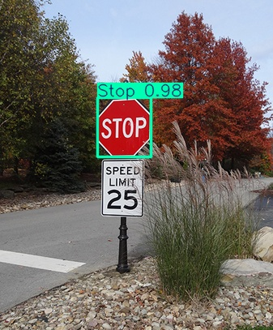

# 🚗 Autonomous Vehicle Perception System (YOLOv8)

## 📌 Project Overview

In the development of **Autonomous Vehicles (AV)** and **Advanced Driver Assistance Systems (ADAS)**, the "Perception" stack is responsible for understanding the environment.

This project implements a real-time object detection system capable of identifying critical road assets (vehicles, pedestrians, traffic signs, and traffic lights). Utilizing the **YOLOv8 (You Only Look Once)** architecture, the model is optimized for **low-latency inference**, making it suitable for deployment on edge computing hardware typically found in vehicles.

The project includes the full pipeline: Data acquisition, model training, evaluation, and **exporting to ONNX** for cross-platform deployment.

## 🎯 Key Features

  * **Real-Time Detection:** Utilizes the `YOLOv8n` (Nano) model, prioritizing inference speed (FPS) for safety-critical applications.
  * **Multi-Class Detection:** Trained to identify multiple classes of road objects simultaneously.
  * **Edge-Ready Export:** The model is converted to **ONNX (Open Neural Network Exchange)** format, enabling deployment on embedded systems (e.g., NVIDIA Jetson, Raspberry Pi, C++) without Python dependencies.
  * **Data Pipeline:** Automated dataset handling and preprocessing using the Roboflow API.

## 🗂️ Dataset

  * **Source:** [Roboflow Universe - Self Driving Cars Dataset](https://universe.roboflow.com/selfdriving-car-qtywx/self-driving-cars-lfjou)
  * **Preprocessing:** Auto-orientation and resizing (640x640).
  * **Classes:** (11 Classes including):
      * Vehicles (Car, Truck, Bus, Biker)
      * Vulnerable Road Users (Pedestrian, Rider)
      * Traffic Control (Traffic Light, Traffic Sign)

## 🛠️ Tech Stack

  * **Framework:** Ultralytics YOLOv8 (PyTorch backend)
  * **Language:** Python
  * **Data Management:** Roboflow API
  * **Data Analysis:** Pandas (for parsing training logs)
  * **Model Exchange:** ONNX

## 🏎️ Engineering Context (Why ONNX?)

As a Mechanical Engineer transitioning to AI, I focused on the **deployment** aspect of this project.

While PyTorch (`.pt`) weights are excellent for training, they are heavy and require a Python environment. By exporting to **ONNX**, this perception system becomes portable. It can now be integrated into a **C++** application running on an automotive ECU or optimized further using **NVIDIA TensorRT** for maximum frame rate on embedded hardware.

-----
